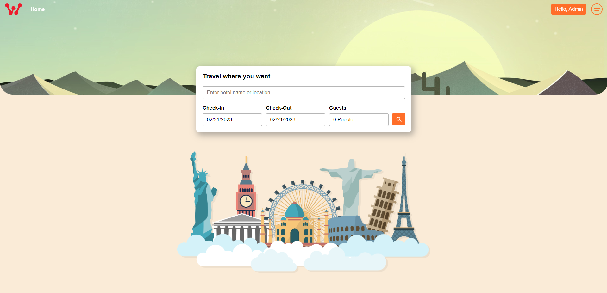
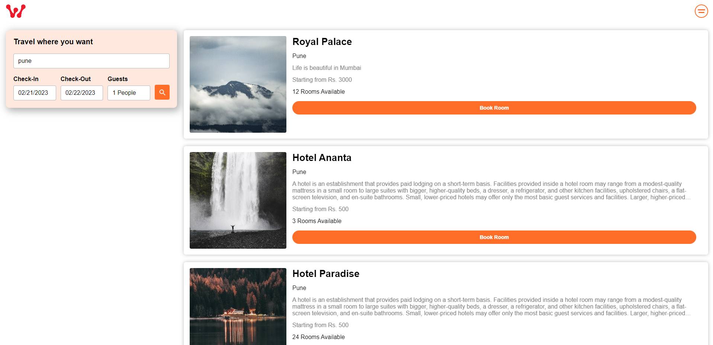
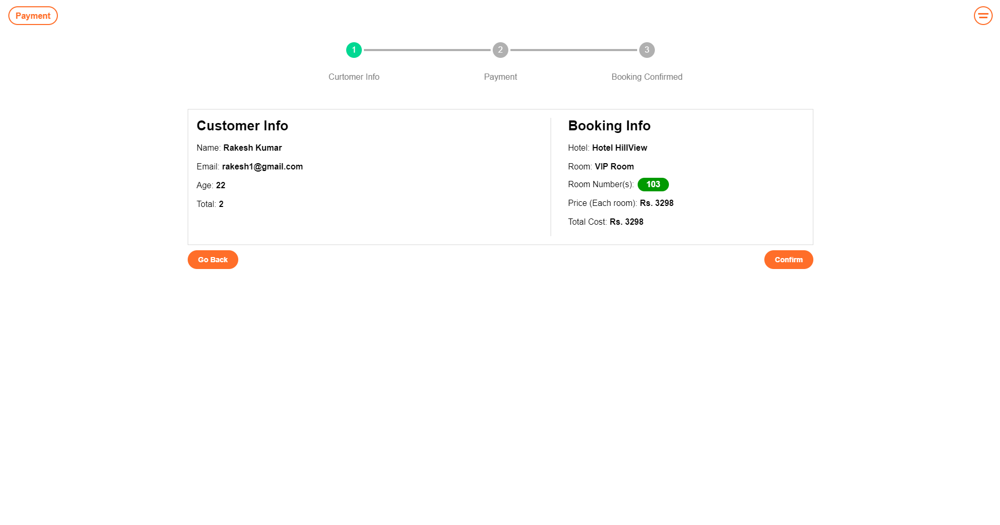

<h1 align="center">Hotel Booking Web App</h1>
  <p align="center">
    A hotel room booking web app with MERN Stack.    <br />
    <a href="https://hotel-booking-web-app.vercel.app/">Live Site</a>
    .
    <a href="https://github.com/DebjitPramanick/Hotel-Booking-Web-App/issues">Report Bug</a>
    ·
    <a href="https://github.com/DebjitPramanick/Hotel-Booking-Web-App/issues">Request Feature</a>
  </p>
</p>


<!-- TABLE OF CONTENTS -->
<details open="open">
  <summary>Table of Contents</summary>
  <ol>
    <li>
      <a href="#about-the-project">About The Project</a>
      <ul>
        <li><a href="#built-with">Built With</a></li>
      </ul>
    </li>
    <li>
      <a href="#getting-started">Getting Started</a>
      <ul>
        <li><a href="#prerequisites">Prerequisites</a></li>
        <li><a href="#installation">Installation</a></li>
      </ul>
    </li>
    <li><a href="#roadmap">Roadmap</a></li>
    <li><a href="#contributing">Contributing</a></li>
    <li><a href="#contact">Contact</a></li>  </ol>
</details>


<!-- ABOUT THE PROJECT -->
## About The Project


<br>

### Description
Simple booking app (aplysia.app) with content management system. Users can book rooms in different hotels for specific dates. Hotel managers can create, update, delete a hotel and its rooms. Admin can manage everything.

### Tech Stack
* [React](https://reactjs.org/)
* [Node JS](https://nodejs.org/en/)
* [Express JS](https://expressjs.com/)
* [GraphQL](https://graphql.org/)
* [MongoDB](https://www.mongodb.com/)
* [Stripe](https://stripe.com/en-in)


<!-- GETTING STARTED -->
## Getting Started

To get a local copy up and running follow these simple example steps.

### Prerequisites

These things must be installed in your system.
* [NPM](https://nodejs.org/en/)

### Installation

1. Clone the repo
   ```sh
   git clone https://github.com/DebjitPramanick/Hotel-Booking-Web-App.git
   ```
2. Open the project folder
4. Now open MongoDB
5. Create a database collection
6. Copy connection url
7. Now run
   ```sh
   cd server
   ```
8. Create .env file
9. Paste the connection url of DB with key name = MONGO_URL
10. Now run commands
    ```sh
    npm i
    nodemon server.js
    ```
11. Now open new terminal
12. Now run commands
    ```sh
    cd client
    npm i
    npm start
    ```
   
<!-- USAGE EXAMPLES -->
## Usage

Here are some examples of how my app works.

Login credentials:
Email: admin2023@gmail.com
Pass: 1234

<br>

<br>

<br>

<br>

<br>

<br>

<!-- ROADMAP -->
## Roadmap

See the [open issues](https://github.com/DebjitPramanick/Hotel-Booking-Web-App/issues) for a list of proposed features (and known issues).


<!-- CONTRIBUTING -->
## Contributing

Contributions are what make the open source community such an amazing place to be learn, inspire, and create. Any contributions you make are **greatly appreciated**.

1. Fork the Project
2. Create your Feature Branch (`git checkout -b feature/AmazingFeature`)
3. Commit your Changes (`git commit -m 'Add some AmazingFeature'`)
4. Push to the Branch (`git push origin feature/AmazingFeature`)
5. Open a Pull Request

# Albatroost

**加入 Albatroost，共建数字游民友好型栖息地 🕊️**\
**Join Albatroost and build a digital-nomad-friendly roost together 🕊️**

**Albatroost** 是一个开源平台，旨在打造全球数字游民的线上落脚社区和线下栖息驿站。\
**Albatroost** is an open-source platform designed to create an online community and offline roosts for digital nomads worldwide.

无论你是代码贡献者、设计师，还是想分享优质行程和住宿经验的旅行家，都欢迎来到这里——\
Whether you are a code contributor, designer, or a traveler looking to share quality itineraries and accommodation tips, you are welcome here—

- ⭐ **Fork & Star |** 为项目点赞，助力更多人发现  /  Fork & star the repo to help others find us
- 🛠️ **贡献代码 |** PR、Issue、优化文档，一起完善功能  /  Contribute code: open PRs, Issues, and improve documentation
- 🎨 **设计 & 文案 |** 提交 Logo、UI 建议，或翻译多语言  /  Design & copy: submit logos, UI suggestions, or translations
- 🌍 **分享资源 |** 推荐优质民宿、活动场所，让全球游民都住得安心  /  Share resources: recommend great hostels and venues to make nomads feel at home

**立即动手，一起让 Albatroost 成为你的第二个“家”！**\
**Get started now and make Albatroost your second home!**

---

我的青年旅社位于萨拉热窝，欢迎随时来访；\
My hostel is located in Sarajevo—feel free to visit anytime;

我本人没有任何开发经验，这些文档和功能都是借助 AI 完成的，期待与你一起成长！\
I personally have no development experience; this project is built with the help of AI. Looking forward to growing together!


<!-- CONTACT -->
## Contact

Twitter - [@debjitpmk](https://twitter.com/debjitpmk)<br/> 
LinkedIn - [Debjit Pramanick](https://www.linkedin.com/in/debjit-pramanick-7a6a971b1/)<br/> 
Project Link: [https://github.com/DebjitPramanick/Hotel-Booking-Web-App](https://github.com/DebjitPramanick/Hotel-Booking-Web-App)
